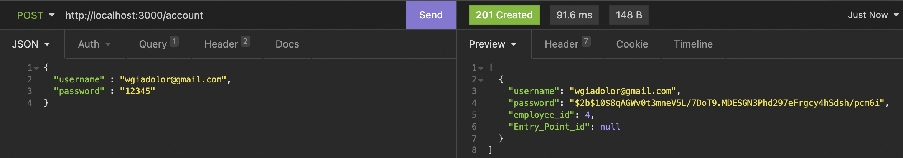
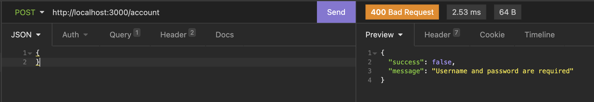
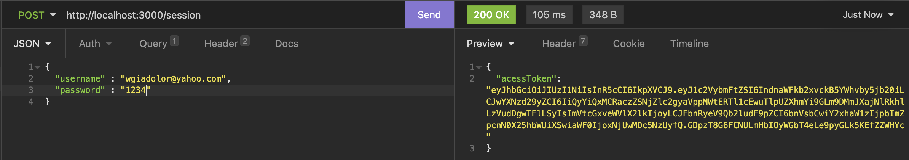
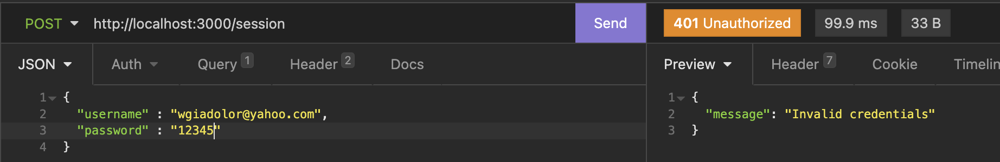
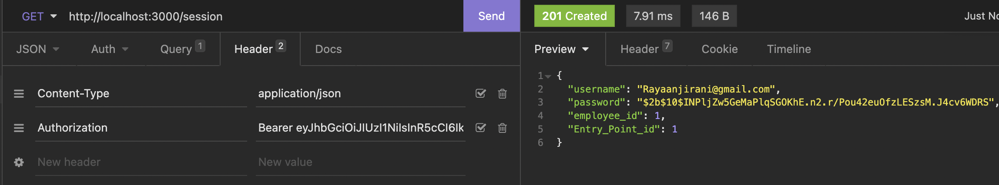
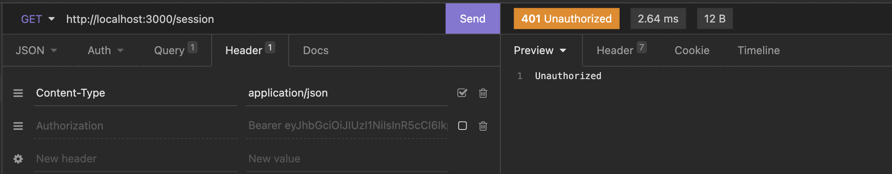
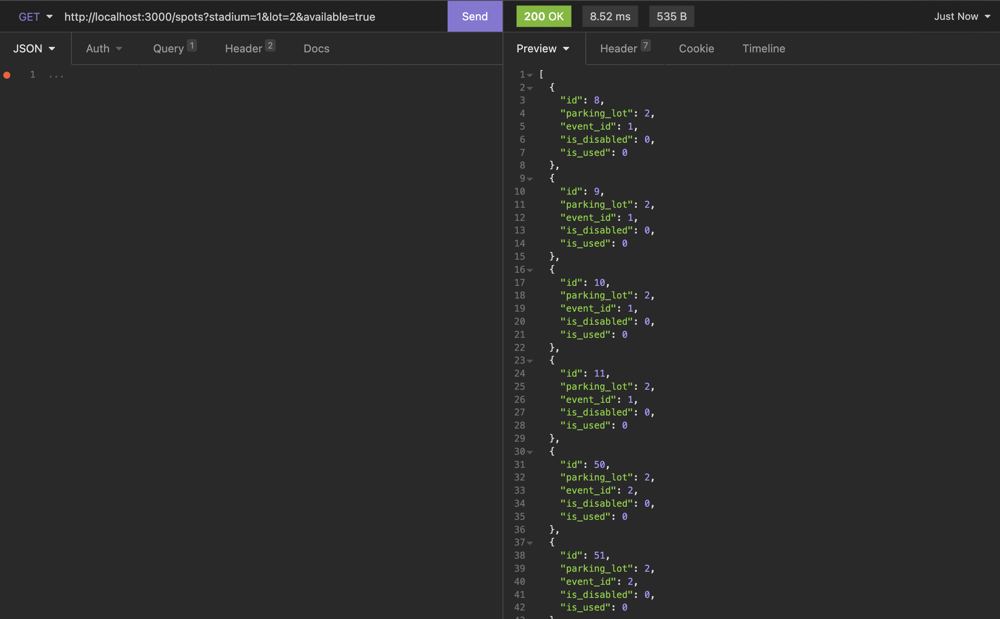
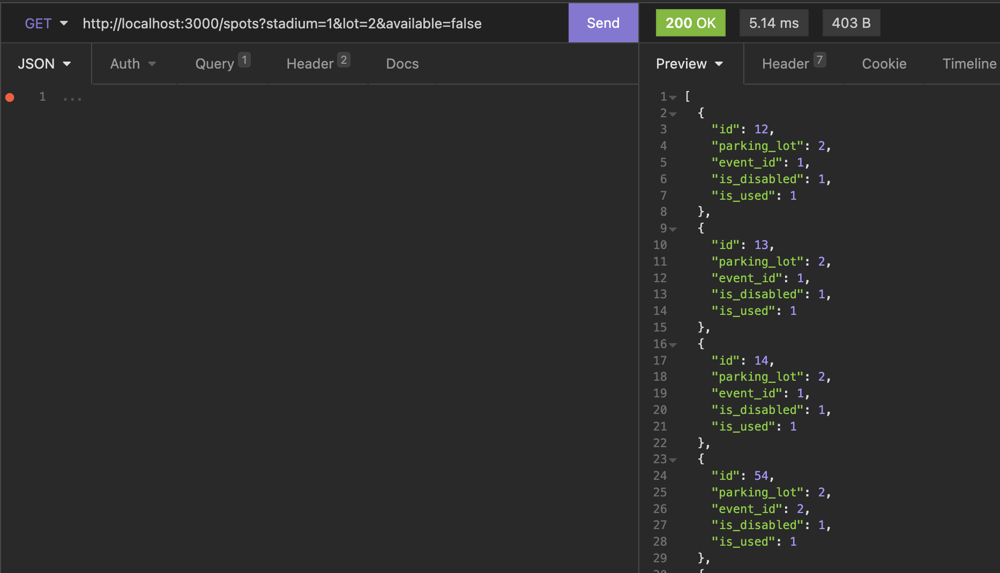
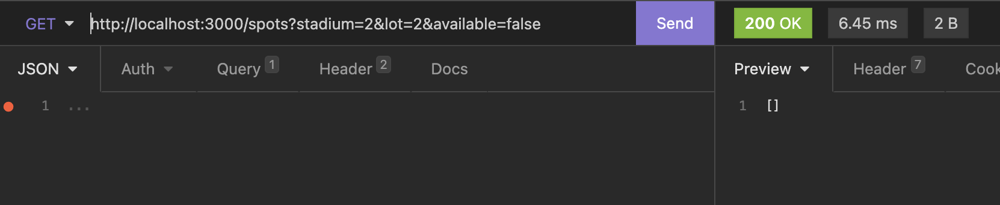
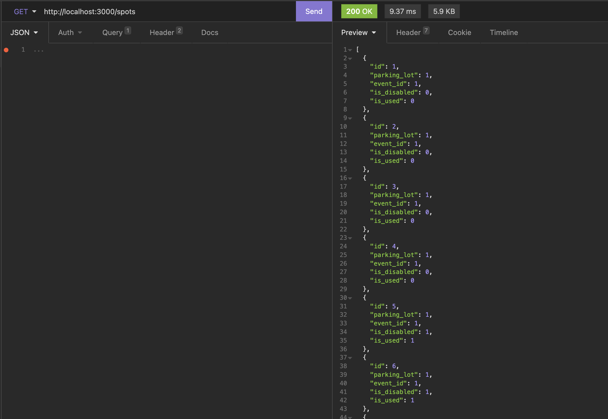

#Program 2

#By Rayaan Irani & Westley Giadolor

#About:
This program was assigned as a part of Westley and my Databases class at SMU. 
The purpose of the program was to implement an API that primitave supports for parking allocation and management.
To complete this project we completed multiple routes including a POST /Accout which registers a user, a POST /Session which provides a user 
with a session token, a GET Session which given that token proivdes all of the user's account info.
A GET /Spots which generates all spots which meet multiple (optional) filters
A POST /Allocation which generates a parking allocation which is where a given vehicle would park
A PUT /Allocation which updates a parking allocation
A DELETE /Allocation which deletes a parking allocation

#Setup:
This program is a RESTful API wirtten in JS and which employs the express framework.

To run this program first, make sure that node is installed by runnung the command:
brew install node (or npm install -g node)

Once you have done this, you need to update the information in the knexfile.js file to match your username, password, and the location of your database.

Then run the following commands:
1. npm init -y
2. npm install
3. node index.js

#Usage of API:

#POST /Account
This route is used to register a user.

An example of a valid input and response is given:

When no parameters are inputed the error response is,

#POST /Session
This route is used to create a session token for a user.

When the incorrect parameters are inputed the error response is,

#GET /Session
This route is used to get all of the user's account info.
It (alongside all future routes) requires a session token.

When the token is not passed or incorrect the following response is given:

#GET /Spots
This route is used to get all of the spots which meet the given filters.

When the filters change so does the response.

And when there is no matches to the filters the following response is given:

Filters are optional and when none are used, all of the spots are returned.

